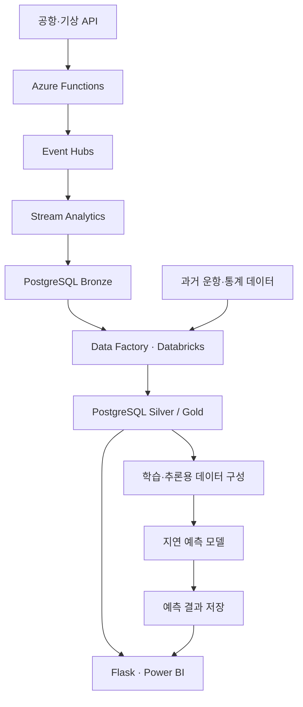

# ✈️ FirstAirline — 인천공항 실시간 정보·지연 예측 서비스

> 공항 이용객이 항공편·혼잡도·주차 정보를 한 번에 확인할 수 있도록, Azure 데이터 파이프라인과 항공편 지연 예측을 연결한 팀 프로젝트입니다.

## 1. 프로젝트 요약

| 항목 | 내용 |
|---|---|
| 개발 형태 | 6인 팀 프로젝트 |
| 개발 기간 | 2025년 7월 · 공식 구현 2주, 사전 팀 구성 및 아이디어 논의 약 1주 |
| 본인 | 임승수 |
| 핵심 담당 | Azure 데이터 수집·정제 파이프라인 구현, 학습·추론용 데이터 공동 구성, 중복 호출 문제 공동 해결 |
| 핵심 기술 | Python, PySpark, Azure Functions, Event Hubs, Stream Analytics, Data Factory, Databricks, PostgreSQL |
| 팀 결과물 | Flask 웹 서비스, Power BI 대시보드, 항공편 지연 예측 모델 |
| 현재 상태 | Azure 리소스 및 웹 서비스 운영 종료 · 코드, 시연 GIF, 발표자료 공개 |

## 2. 주요 결과 미리보기

### 항공편 검색 시연

### 핵심 결과

- **데이터 수집부터 서비스 조회까지 연결**  
  API와 과거 운항 데이터를 수집·정제하고, PostgreSQL에 저장하여 웹 서비스와 대시보드에서 활용했습니다.

- **학습·추론 데이터의 입력 구성 일치**  
  정적 학습 데이터와 실시간 API에서 공통으로 확보할 수 있는 피처를 선별해 모델 입력 데이터를 구성했습니다.

- **항공편 지연 예측 결과 제공**  
  팀에서 개발한 LightGBM 회귀 모델의 예측 결과를 저장하고 항공편 검색 화면에서 조회하도록 연결했습니다.

[발표자료 보기](docs/1팀_발표%20자료%28최종본%29.pdf) · [대시보드 자료 보기](dashboard/) · [시연 이미지 보기](docs/images/)

## 3. 프로젝트 목적과 핵심 기능

### 해결하려던 문제

공항 이용객은 항공편 운항 정보, 터미널 혼잡도, 주차 현황, 기상 상태 등을 함께 확인해야 합니다. 서로 다른 출처의 정보를 통합하고, 이용할 항공편을 기준으로 필요한 정보를 한 번에 제공하는 서비스를 목표로 했습니다.

### 팀 전체 구현 기능

| 기능 | 내용 |
|---|---|
| 항공편 검색 | 운항 시간, 터미널, 탑승구 등 항공편 정보 조회 |
| 지연 시간 예측 조회 | 항공편별 예상 지연 시간을 검색 결과에 표시 |
| 혼잡도·대기질 확인 | 터미널 혼잡 정보 및 실내 대기질 제공 |
| 주차 정보 확인 | 주차 현황과 요금 정보 제공 |
| 대시보드 | Power BI를 활용한 혼잡도·대기질·주차 정보 시각화 |
| 다국어 질의응답 | 공항 데이터를 참고하여 사용자 질문 언어에 맞춘 답변 생성 |

> 위 기능은 팀 전체 결과물입니다. 본인의 직접 구현 및 공동 참여 범위는 아래에 구분했습니다.

## 4. 본인 담당 역할

**데이터 수집·정제 파이프라인을 직접 구현하고, 모델이 사용할 학습·추론 데이터를 팀원과 함께 구성했습니다.**

| 구분 | 수행 내용 | 관련 코드 |
|---|---|---|
| 직접 구현 | 담당 원천 데이터 수집 및 Azure 파이프라인을 통한 Silver 테이블 전처리·적재 | [수집 함수](src/data_pipeline/realTime_data/datacollection/function_app.py), [Stream Analytics](src/data_pipeline/realTime_data/processed_bronze/StreamAnalyticsJobquery/), [Data Factory](src/data_pipeline/realTime_data/processed_silver/DataFactory/) |
| 공동 수행 | 정적 학습 데이터와 실시간 추론 데이터의 공통 피처 선별 및 PySpark 기반 입력 데이터 구성 | [예측용 데이터 처리](src/ml/make_data_for_prediction/), [분석 노트북](src/ml/Databricks_notebooks/) |
| 공동 해결 | 팀원 1명·멘토와 함께 파이프라인 중복 호출 및 적재 문제를 단계별로 분석하고 조치 | [트러블슈팅 기록](docs/트러블%20슈팅%20정리.xlsx) |

모델 학습·비교 및 최종 모델 선정은 다른 팀원이 담당했습니다. Flask 웹 구현과 Power BI 시각화 역시 팀원의 담당 영역이며, 본인 기여는 데이터 처리와 모델 입력 구성에 집중되어 있습니다.

## 5. 시스템 구조와 기술 활용

### 주요 데이터 흐름

전체 흐름을 요약한 다이어그램입니다. 데이터 종류에 따라 사용하는 정제 서비스와 처리 경로는 달라집니다.

### 데이터 계층

| 계층 | 역할 |
|---|---|
| Bronze | 원천 데이터를 수집하여 보관 |
| Silver | 날짜·타입 정리와 파생 컬럼 생성 등 데이터별 전처리 |
| Gold | 분석·모델·서비스에서 사용할 데이터를 선별하고 통합 |

PostgreSQL을 중심으로 Bronze–Silver–Gold 계층을 구분하여 메달리온 아키텍처의 데이터 처리 개념을 적용했습니다.

### 기술별 활용 목적

| 기술 | 활용 목적 |
|---|---|
| Azure Functions | 데이터별 주기에 따른 API 호출 및 이벤트 전송 |
| Event Hubs | 수집 이벤트를 후속 처리 단계로 전달 |
| Stream Analytics | 이벤트 필드 추출, 배열 전개, 시간 윈도우 기반 처리 |
| Data Factory | 데이터 정제 및 파이프라인 실행 연계 |
| Databricks / PySpark | 과거 데이터 가공 및 학습·추론용 데이터 구성 |
| PostgreSQL | 계층별 데이터와 서비스 조회용 테이블·뷰 관리 |
| Flask / Power BI | 사용자 검색 화면 및 대시보드 제공 |

전체 프로젝트 아키텍처 보기

## 6. 주요 구현과 문제 해결

### 6-1. 원천 데이터를 Silver 테이블까지 연결

**과제**

API마다 응답 구조와 데이터 갱신 주기가 달라, 원천 데이터를 분석과 서비스 조회에 사용할 수 있는 형태로 변환해야 했습니다.

**구현**

- Azure Functions에서 담당 API를 호출하고 Event Hubs로 전달
- Stream Analytics에서 필요한 필드를 추출하여 Bronze 적재 흐름 구성
- Data Factory를 연계해 데이터별 전처리 후 Silver 테이블로 이동
- 날짜 분리, 데이터 타입 정리, 필요한 컬럼 가공 등 후속 활용을 위한 정제 수행

**결과**

담당 데이터를 수집하는 단계부터 정제된 테이블로 제공하는 단계까지 연결했습니다.

> 본 프로젝트의 ‘실시간’은 API 주기 수집과 스트리밍 처리를 의미합니다. 실제 데이터 최신성은 원천 API의 갱신 주기와 후속 처리 주기에 영향을 받습니다.

관련 코드: [실시간 데이터 파이프라인](src/data_pipeline/realTime_data/)

### 6-2. 정적 학습 데이터와 실시간 추론 데이터의 피처 정합성 확보

**과제**

과거 운항 데이터에는 다양한 정보가 있었지만, 실시간 API에서 제공하는 피처는 제한적이었습니다. 학습에만 존재하는 피처를 사용하면 실제 서비스의 추론 입력을 구성하기 어려웠습니다.

**공동 수행 내용**

- 정적 데이터와 실시간 API의 제공 컬럼 비교
- 두 데이터에서 같은 의미로 확보할 수 있는 공통 피처 선별
- PySpark를 활용해 학습용·추론용 데이터 가공
- 모델 학습과 실시간 추론에서 동일한 입력 구성을 사용할 수 있도록 정리

**결과**

과거 데이터로 학습한 모델에 실시간 데이터를 입력할 수 있도록 데이터 구성을 맞췄습니다. 학습 데이터의 정보량뿐 아니라 실제 추론 시점의 데이터 가용성을 함께 고려했습니다.

관련 코드: [예측용 데이터 처리](src/ml/make_data_for_prediction/), [분석 노트북](src/ml/Databricks_notebooks/)

### 6-3. 파이프라인 중복 호출과 적재 문제 해결

**문제**

동일 데이터의 중복 적재와 후속 Data Factory 작업의 과도한 실행이 발생했습니다. 데이터 정합성뿐 아니라 불필요한 클라우드 사용 비용에도 영향을 주는 문제였습니다.

**분석 및 조치**

본인과 팀원 1명, 멘토가 함께 API 호출부터 후속 파이프라인까지 단계별로 점검했습니다.

- Function App의 시작·재시작 시 실행 조건 점검
- Function App 재배포
- 비슷한 시점에 유입되는 이벤트를 처리하도록 Stream Analytics 쿼리 조정

**결과 및 학습**

중복 호출 문제를 해결했으며, 수집 함수만이 아니라 이벤트 전달과 후속 작업의 실행 조건까지 함께 확인하는 경험을 쌓았습니다.

시간 윈도우 기반 그룹화와 전체 파이프라인의 중복 방지는 구분해야 하므로, 이를 단일 트랜잭션이나 Exactly-once 처리 보장으로 표현하지 않았습니다.

관련 자료: [트러블슈팅 기록](docs/트러블%20슈팅%20정리.xlsx)

## 7. 팀 성과와 검증 범위

### 데이터 및 모델 결과

| 항목 | 결과 | 범위 |
|---|---|---|
| 과거 운항 데이터 | 최근 2년 약 40만 행 | 발표자료 기준 원천 데이터 규모 |
| 예측 대상 | 항공편 지연 시간(분) | 회귀 예측 |
| 최종 모델 | LightGBM | 다른 팀원이 학습·비교 및 선정 담당 |
| 발표자료의 최종 평가 | MAE 19.25분 | 발표 당시 기록된 팀 모델 결과 |
| 서비스 연결 | 저장된 예측 결과를 항공편 검색 화면에서 조회 | 팀 전체 구현 결과 |

MAE 19.25분은 발표자료에 제시된 결과입니다. 평가 데이터 규모와 분할 조건을 함께 확정할 수 없어 일반화 성능이나 다른 실험 대비 개선율로 해석하지 않습니다.

### 서비스 연결 방식

모델의 예측 결과를 PostgreSQL에 저장하고, Flask에서 날짜·편명·출발 예정 시간을 기준으로 조회합니다.

사용자 요청마다 모델을 실행하는 방식이 아니라, **저장된 예측 결과를 검색 화면에 제공하는 구조**입니다.

관련 코드: [예측 결과 생성·저장](src/ml/Databricks_notebooks/forecast_model_final.ipynb), [웹 조회 코드](src/webapp/app.py)

### 한계

- 일부 혼잡도 관련 피처에는 통계 기반 추정치가 사용되었습니다.
- 데이터 갱신은 원천 API와 파이프라인 실행 주기의 영향을 받습니다.
- 항공편 지연 예측은 실제 운항을 보장하는 정보가 아닌 참고 정보입니다.
- 현재 Azure 리소스와 웹 서비스는 종료되어 실시간 서비스 접속은 제공하지 않습니다.

## 8. 기술 스택과 프로젝트 확인 방법

### 기술 스택

| 영역 | 사용 기술 |
|---|---|
| 언어·데이터 처리 | Python, SQL, PySpark, Pandas |
| 수집·스트리밍 | Azure Functions, Event Hubs, Stream Analytics |
| 정제·오케스트레이션 | Azure Data Factory, Databricks |
| 저장소 | PostgreSQL |
| 모델 실험 — 팀 | Azure ML Studio, Databricks, LightGBM 등 |
| 웹·시각화 — 팀 | Flask, Power BI |
| AI 질의응답 — 팀 | Azure OpenAI |

### 주요 라이브러리 버전

공개된 웹 앱의 `requirements.txt`에 기록된 버전입니다. 데이터 처리·모델 학습 환경 전체의 버전을 의미하지 않습니다.

| 라이브러리 | 버전 | 용도 |
|---|---|---|
| Flask | 3.1.1 | 웹 서버 |
| psycopg2 | 2.9.10 | PostgreSQL 연결 |
| python-dotenv | 1.1.1 | 환경 변수 로딩 |
| openai | 1.97.0 | Azure OpenAI 호출 |
| requests | 2.32.4 | HTTP 요청 |

[웹 앱 의존성](src/webapp/requirements.txt) · [수집 함수 의존성](src/data_pipeline/realTime_data/datacollection/requirements.txt)

### 프로젝트 확인 방법

이 저장소는 종료된 클라우드 프로젝트의 구현 코드와 결과를 정리한 아카이브입니다. 로컬 실행 안내 대신 다음 자료를 통해 프로젝트를 확인할 수 있습니다.

| 확인 목적 | 참고 자료 |
|---|---|
| 서비스 동작과 사용자 화면 | 상단 시연 GIF 및 [서비스 이미지](docs/images/) |
| 본인 데이터 파이프라인 구현 | [실시간 데이터 처리 코드](src/data_pipeline/realTime_data/) |
| 학습·추론용 데이터 처리 | [예측용 데이터 구성](src/ml/make_data_for_prediction/) |
| 팀 모델 실험 | [모델 노트북](src/ml/Databricks_notebooks/) |
| 대시보드 결과 | [Power BI 파일 및 PDF](dashboard/) |
| 전체 프로젝트 설명 | [발표자료](docs/1팀_발표%20자료%28최종본%29.pdf) |

## 9. 관련 자료

- [팀 발표 PDF](docs/1팀_발표%20자료%28최종본%29.pdf)
- [테이블 명세서](data/docs/)
- [트러블슈팅 기록](docs/트러블%20슈팅%20정리.xlsx)
- [팀 회의록](docs/회의록.xlsx)
- [Azure ML Studio 실험 화면](src/ml/MLstudio/)
